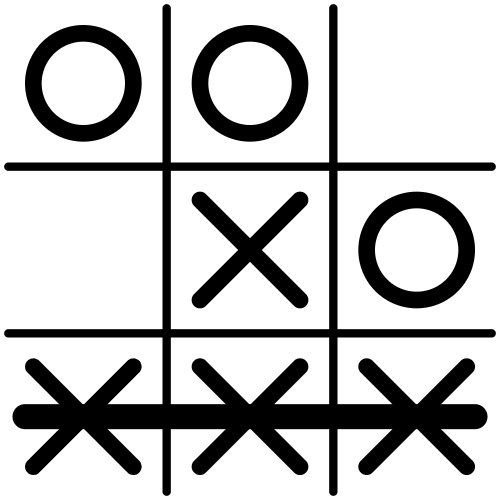

# Programming Fundamentals (Python)

This repository contains projects developed for the Programming Fundamentals class at IST.  
Both projects implement classic games with AI opponents using object-oriented TAD (Abstract Data Types) design patterns.

---

## 📋 Projects

1. **Tic-Tac-Toe** (`tictactoe.py`)
2. **Nine Men's Morris** (`ninemanmorris.py`)

---



## 🎮 Tic-Tac-Toe (`tictactoe.py`)

A complete Tic-Tac-Toe game with a human player vs. computer opponent.  
The game state is represented as a 3x3 tuple of tuples, using `1` for X, `-1` for O, and `0` for an empty cell.

### Features

- **Board validation and accessors** for rows, columns, and diagonals.
- **Move validation** and immutable board updates (returns a new board).
- **Three AI difficulty modes**: `basico`, `normal`, `perfeito`.
- **Strategic algorithms**:
  - `basico`: Prioritizes center, then corners, then sides.
  - `normal`: Adds win detection and opponent blocking.
  - `perfeito`: Implements bifurcation strategy for unbeatable play.

### Public API

| Function | Description |
|----------|-------------|
| `jogo_do_galo(jogador, modo)` | Starts interactive game (human vs computer). |
| `escolher_posicao_auto(tab, j, modo)` | Returns computer's next move. |
| `marcar_posicao(tab, j, n)` | Returns new board with position marked. |
| `tabuleiro_str(tab)` | Returns printable string representation. |
| `jogador_ganhador(tab)` | Returns `1`, `-1`, or `0` (winner or none). |

### How to Run

From a terminal:

```bash
python3
```

Inside the Python REPL:

```python
import tictactoe as t

# Choose your symbol: 'X' or 'O'
# Choose AI mode: 'basico', 'normal', or 'perfeito'
t.jogo_do_galo('X', 'perfeito')
```

### Position Layout

```
1 2 3
4 5 6
7 8 9
```

---


## 🎯 Nine Men's Morris (`ninemanmorris.py`)

An implementation of the classic **Nine Men's Morris** game with AI using the **Minimax algorithm**.  
The game uses three TADs (Abstract Data Types): Position, Piece, and Board.

### Game Overview

- **Objective**: Get three pieces in a line (horizontal or vertical).
- **Phases**:
  - **Placement phase** (first 3 moves per player): Place pieces on empty positions.
  - **Movement phase** (after placement): Move pieces to adjacent positions.
- **AI difficulty levels**: `facil`, `normal`, `dificil`.

### TAD: Position (`cria_posicao`)

Represents board positions using column (a, b, c) and row (1, 2, 3).

```python
p = cria_posicao('a', '1')  # Top-left corner
```

### TAD: Piece (`cria_peca`)

Represents game pieces: `'X'`, `'O'`, or `' '` (empty).

```python
x_piece = cria_peca('X')
o_piece = cria_peca('O')
```

### TAD: Board (`cria_tabuleiro`)

Dictionary-based board representation. Validates game rules automatically.

```python
t = cria_tabuleiro()  # Creates empty 3x3 board
coloca_peca(t, x_piece, cria_posicao('b', '2'))  # Place piece at center
```

### AI Strategy

The solver uses **Minimax algorithm** with configurable depth:

| Difficulty | Depth | Strategy |
|-----------|-------|----------|
| `facil` | Random moves | Moves to first available adjacent position. |
| `normal` | 1-ply lookahead | Evaluates immediate consequences. |
| `dificil` | 5-ply lookahead | Deep strategic thinking. |

### Key Functions

| Function | Description |
|----------|-------------|
| `moinho(j, dificuldade)` | Starts the game with piece choice and difficulty. |
| `obter_movimento_manual(t, j)` | Gets human player's move (input). |
| `obter_movimento_auto(t, j, modo)` | Returns computer's move based on difficulty. |
| `minimax(t, j, profundidade, seq_movimentos)` | Implements Minimax search. |
| `tabuleiro_para_str(t)` | Prints visual board representation. |

### Board Layout

```
   a   b   c
1 [·]-[·]-[·]
   | \ | / |
2 [·]-[·]-[·]
   | / | \ |
3 [·]-[·]-[·]
```

### How to Run

```bash
python3
```

Inside the Python REPL:

```python
import ninemanmorris as mm

# Choose your piece: '[X]' or '[O]' (X plays first)
# Choose difficulty: 'facil', 'normal', or 'dificil'
mm.moinho('[X]', 'normal')
```

---

## 🏗️ Design Patterns

Both projects follow **TAD (Abstract Data Type)** principles:

- **Constructor functions**: `cria_X()` create new instances.
- **Selector functions**: `obter_X()` retrieve attributes.
- **Recognizer functions**: `eh_X()` validate instances.
- **Transformer functions**: `X_para_str()` convert to strings.
- **Comparator functions**: `X_iguais()` compare instances.

This design ensures **encapsulation** and **modularity**, making code reusable and testable.

---

## 🧰 Dependencies

- **Python 3.6+**
- No external libraries required.

---

## 📚 Algorithms Used

### Tic-Tac-Toe

- **Minimax tree search** (perfeito mode)
- **Bifurcation analysis** (detecting fork strategies)
- **Strategic heuristics** (center/corner priorities)

### Nine Men's Morris

- **Minimax with alpha-beta pruning potential** (dificil mode)
- **Move generation** (valid positions based on board state)
- **Win condition evaluation**

---

## 👨‍💻 Author

**Tiago Miguel Rocha dos Santos** (ist199333)  
Developed for Programming Fundamentals (Programação) at IST.

---

## 📝 Notes

- Both projects use immutable board representations where applicable (Tic-Tac-Toe returns new tuples; Nine Men's Morris returns modified dictionaries).
- AI difficulty scales with search depth and strategic evaluation.
- Position validation ensures game rule compliance.
- Comments in code are in Portuguese, reflecting the original course language.
